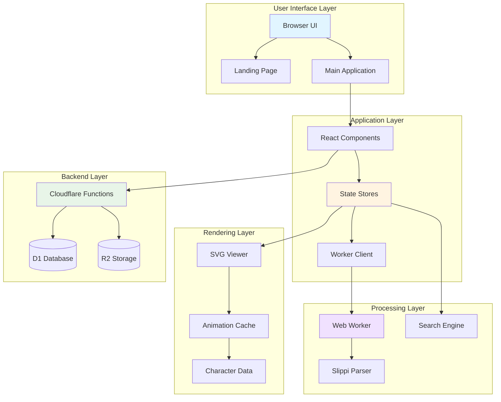
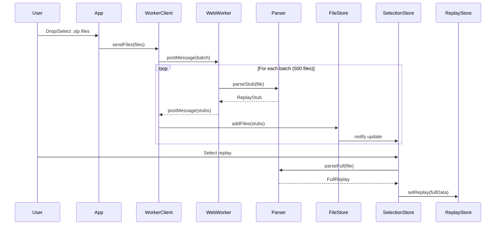
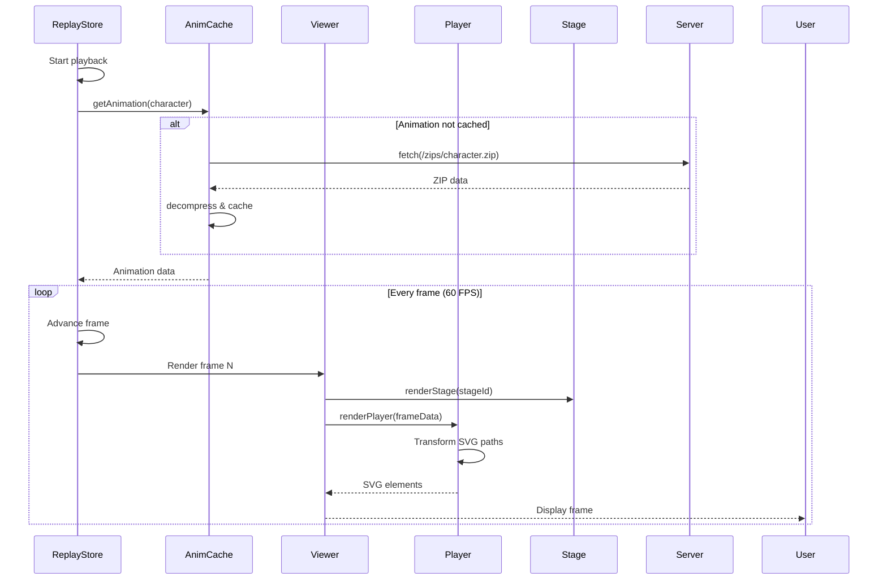
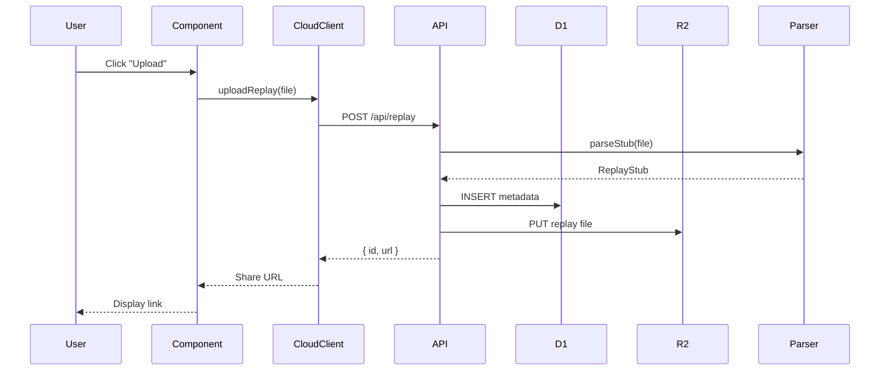
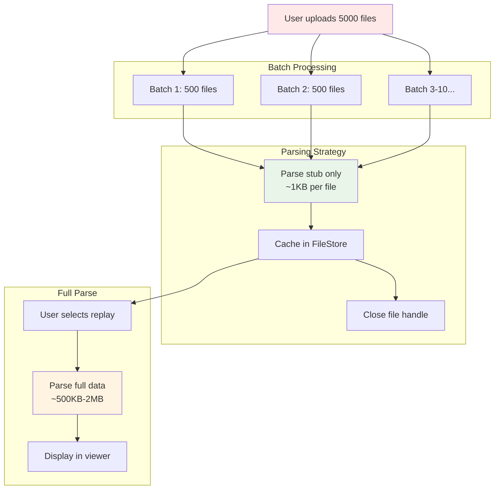
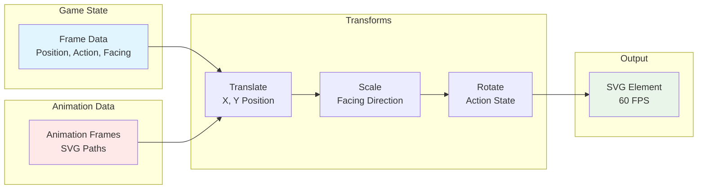

<p align="center">
  <a href="https://slippilab.com" target="_blank" rel="noopener noreferrer">
    
  </a>
</p>

# Slippi Lab

Slippi replays in the browser. This is the code base for
[slippilab.com](https://www.slippilab.com).


## Features

### Smooth instant playback

Replay files contain rich data about every frame: positions, action states,
inputs, and more. This lets us start playing from anywhere without resimulation
or hesitation. Combined with some replay-focused controls like frame-by-frame,
slowmo/fastforward, and short jumps (2s instead of 5s or 10s), we can offer an
unmatched viewing experience.

### Filters

Find replays within a folder quickly using a specific combination of characters,
stage, Slippi connect code, Slippi display name, or in-game nametag.

### Insights

Important moments in the selected replay are automatically detected and listed,
so less time is needed to find specific situations when browsing.

### Sharing

Upload your replay and grab a quick link to share a match with anyone.

## Limitations

### No realistic rendering

Without resimulating and/or using 3D models from the game, a lot of detailed
effects and realism are not possible:

- dynamic clothing effects like dresses, capes, and hair
- footsnap and other dynamic deviations from .slp positions like throws
  ("attach thrower bone X to throwee bone Y")
- perspective camera (we use orthographic)

### Ultra large datasets

While large data sets do run fine after taking time to parse (tested with 5k
replays), we can easily reach the limits of the machine's RAM space. We do some
tricks to save space:

- parse files in batches of a few hundred files at a time and close them all
  before starting the next batch
- only parsing enough of each file to provide filtering support
- only deeply parsing the currently playing file

These are good for most features, but still have scaling limits and close the
door slightly on some features like searching across all replays. A desktop app
(or maybe some fancy web API/library) could avoid some of these limits by
running a proper database of some kind.

## Development

The site is a Vite app primarily using SolidJS and Tailwind.

Local development:

> `npm run dev`

Build site:

> `npm run build`

## Thanks

The following projects and people are not associated with this project in any
way, but served as references or key dependencies and are greatly appreciated.

- [Project Slippi](https://github.com/project-slippi) by
  [Fizzi](https://twitter.com/Fizzi36) and the entire Project Slippi team

- [slippi-visualiser](https://github.com/schmooblidon/slippi-visualiser) by
  [schmooblidon](https://twitter.com/schmooDev)

- [react-slp-viewer](https://github.com/vinceau/react-slp-viewer) by
  [vinceau](https://twitter.com/_vinceau)

- [HSDraw](https://github.com/Ploaj/HSDlib) by [Ploaj](https://github.com/Ploaj)

---

# Technical Architecture

## Overview

Slippi Lab is a web application that visualizes Super Smash Bros. Melee replays (.slp files) directly in the browser. The application provides frame-by-frame SVG-based visualization, intelligent filtering, automated insights, and cloud-based replay sharing - all without requiring game resimulation.

## Technology Stack

### Frontend
- **SolidJS 1.6.3** - Reactive UI framework
- **Vite 3.2.5** - Build tool and dev server
- **TypeScript 4.9.3** - Type-safe development
- **Tailwind CSS 3.2.4** - Utility-first CSS framework

### Backend/Serverless
- **Hono 4.2.8** - Lightweight web framework
- **Cloudflare Pages** - Hosting and deployment
- **Cloudflare D1** - SQLite database for metadata
- **Cloudflare R2** - Object storage for replay files
- **Wrangler 3.52.0** - Cloudflare CLI

### Data Processing
- **@shelacek/ubjson** - UBJSON parser for .slp files
- **fflate 0.7.4** - Fast zip compression/decompression
- **Web Workers** - Background processing for file parsing

## System Architecture



## Directory Structure & Relationships

### High-Level Organization

```mermaid
graph LR
    subgraph "Root"
        INDEX[index.html]
        CONFIG[Configuration Files]
    end

    subgraph "Source Code"
        SRC[/src]
        COMMON[/src/common]
        COMPONENTS[/src/components]
        STATE[/src/state]
        PARSER_DIR[/src/parser]
        SEARCH_DIR[/src/search]
        VIEWER_DIR[/src/viewer]
    end

    subgraph "Backend"
        FUNCTIONS[/functions]
    end

    subgraph "Static Assets"
        PUBLIC[/public]
    end

    INDEX --> SRC
    SRC --> COMMON
    SRC --> COMPONENTS
    SRC --> STATE
    SRC --> PARSER_DIR
    SRC --> SEARCH_DIR
    SRC --> VIEWER_DIR
    COMPONENTS --> STATE
    STATE --> PARSER_DIR
    STATE --> SEARCH_DIR
    STATE --> VIEWER_DIR
    FUNCTIONS --> PARSER_DIR
    VIEWER_DIR --> PUBLIC

    style INDEX fill:#e1f5ff
    style COMMON fill:#f0e1ff
    style STATE fill:#fff4e1
    style PUBLIC fill:#e8f5e8
```

### /src/common - Shared Utilities

```mermaid
graph TB
    COMMON[/src/common]
    CONSTANTS[constants.ts<br/>Game Constants]
    IDS[ids.ts<br/>Character/Stage Mappings]
    TYPES[types.ts<br/>TypeScript Definitions]
    UTIL[util.ts<br/>File Utilities]

    COMMON --> CONSTANTS
    COMMON --> IDS
    COMMON --> TYPES
    COMMON --> UTIL

    PARSER[/src/parser] -.uses.-> TYPES
    PARSER -.uses.-> CONSTANTS
    SEARCH[/src/search] -.uses.-> TYPES
    SEARCH -.uses.-> IDS
    STATE[/src/state] -.uses.-> TYPES
    STATE -.uses.-> UTIL
    VIEWER[/src/viewer] -.uses.-> IDS
    COMPONENTS[/src/components] -.uses.-> TYPES

    style COMMON fill:#f0e1ff
    style TYPES fill:#fff4e1
```

**Purpose:** Foundation layer providing shared types, constants, and utilities used across all modules.

**Key Files:**
- `constants.ts` - Game constants (FoD platform heights, frame data)
- `ids.ts` - Character and stage ID mappings
- `types.ts` - Core TypeScript type definitions (Replay, Frame, Player, etc.)
- `util.ts` - File filtering and validation utilities

### /src/components - UI Components

```mermaid
graph TB
    COMP[/src/components]
    APP[App.tsx<br/>Root Component]
    LANDING[Landing.tsx<br/>Landing Page]

    subgraph "UI Components"
        COMMON_UI[/common<br/>Reusable UI]
        PANELS[/panels<br/>Side Panels]
        VIEWER_COMP[/viewer<br/>Replay Viewer]
    end

    COMP --> APP
    COMP --> LANDING
    COMP --> COMMON_UI
    COMP --> PANELS
    COMP --> VIEWER_COMP

    APP --> PANELS
    APP --> VIEWER_COMP
    PANELS --> COMMON_UI
    VIEWER_COMP --> COMMON_UI

    PANELS -.uses.-> STATE[State Stores]
    VIEWER_COMP -.uses.-> STATE

    style COMP fill:#e1f5ff
    style APP fill:#fff4e1
```

**Purpose:** React/SolidJS components for UI rendering and user interaction.

**Subdirectories:**

#### /src/components/common
Reusable UI primitives: Badge, Button, Dialog, Icons, Picker, Progress indicators, Toast notifications

#### /src/components/panels
Side panel components:
- `Replays.tsx` - Filterable replay list with virtual scrolling
- `Clips.tsx` - Detected highlights accordion
- `Inputs.tsx` - Input visualization panel
- `Navigation.tsx` - Left navigation sidebar
- `TopBar.tsx` - Top bar controls
- `Sidebar.tsx` - Panel container

#### /src/components/viewer
Replay visualization:
- `Viewer.tsx` - Main SVG viewport (730x600)
- `Stage.tsx` - Stage geometry rendering
- `Player.tsx` - Character sprite rendering
- `Camera.tsx` - Camera positioning
- `HUD.tsx` - Heads-up display overlay
- `Controls.tsx` - Playback controls
- `Timer.tsx` - Game timer display

### /src/state - State Management

```mermaid
graph TB
    STATE[/src/state]

    FILE_STORE[fileStore.tsx<br/>File Loading State]
    REPLAY_STORE[replayStore.tsx<br/>Replay Playback State]
    SELECT_STORE[selectionStore.tsx<br/>Replay Selection State]
    NAV_STORE[navigationStore.tsx<br/>UI Navigation State]

    STATE --> FILE_STORE
    STATE --> REPLAY_STORE
    STATE --> SELECT_STORE
    STATE --> NAV_STORE

    FILE_STORE --> WORKER_CLIENT[workerClient.ts]
    SELECT_STORE --> FILE_STORE
    SELECT_STORE --> CLOUD[cloudClient.ts]
    REPLAY_STORE --> PARSER[/parser]
    REPLAY_STORE --> SEARCH[/search]
    REPLAY_STORE --> VIEWER[/viewer]

    COMPONENTS[Components] -.observe.-> FILE_STORE
    COMPONENTS -.observe.-> REPLAY_STORE
    COMPONENTS -.observe.-> SELECT_STORE
    COMPONENTS -.observe.-> NAV_STORE

    style STATE fill:#fff4e1
    style REPLAY_STORE fill:#ffe1e1
```

**Purpose:** Centralized state management using SolidJS stores.

**Key Stores:**

- **fileStore.tsx** - Manages file upload, parsing progress, and file metadata
- **replayStore.tsx** - Controls replay playback, current frame, playback speed
- **selectionStore.tsx** - Handles replay selection, filtering, and search criteria
- **navigationStore.tsx** - Manages UI panel visibility and navigation state

**Data Flow:**
```
User uploads files → fileStore → workerClient → Web Worker → Parser
                                                                ↓
User selects replay → selectionStore → replayStore → Full parse + Analysis
                                                         ↓
                                            Viewer renders current frame
```

### /src/parser - Slippi File Parser

```mermaid
graph TB
    PARSER_DIR[/src/parser]
    PARSER[parser.ts<br/>UBJSON Decoder]

    PARSER_DIR --> PARSER

    WORKER[worker.ts] -.uses.-> PARSER
    REPLAY_STORE[replayStore.tsx] -.uses.-> PARSER
    FUNCTIONS[/functions API] -.uses.-> PARSER

    PARSER -.reads.-> SLP[(*.slp files)]

    PARSER --> STUB[ReplayStub<br/>Lightweight Metadata]
    PARSER --> FULL[FullReplay<br/>Complete Frame Data]

    style PARSER_DIR fill:#f0e1ff
    style PARSER fill:#fff4e1
```

**Purpose:** Custom .slp file parser that decodes binary UBJSON format into structured data.

**Key Capabilities:**
- Parse game settings only (lightweight stub parsing)
- Full frame-by-frame parsing (positions, states, inputs)
- Event-based parsing (0x35-0x3F event codes)
- Handles FoD platform height data
- Memory-efficient batch processing

**File Format Events:**
- `0x35` - Event Payloads (command sizes)
- `0x36` - Game Start (settings)
- `0x37` - Pre-Frame Update (inputs)
- `0x38` - Post-Frame Update (states)
- `0x39` - Game End
- `0x3A` - Frame Start
- `0x3B` - Item Update
- `0x3F` - FoD Platform Update

### /src/search - Replay Analysis

```mermaid
graph TB
    SEARCH_DIR[/src/search]

    FRAME_PRED[framePredicates.ts<br/>Frame-level Tests]
    GAME_PRED[gamePredicates.ts<br/>Game-level Tests]
    QUERIES[queries.ts<br/>Pre-defined Queries]
    SEARCH_ENGINE[search.ts<br/>Search Engine]

    SEARCH_DIR --> FRAME_PRED
    SEARCH_DIR --> GAME_PRED
    SEARCH_DIR --> QUERIES
    SEARCH_DIR --> SEARCH_ENGINE

    QUERIES --> FRAME_PRED
    QUERIES --> GAME_PRED
    SEARCH_ENGINE --> QUERIES

    REPLAY_STORE[replayStore.tsx] -.uses.-> SEARCH_ENGINE
    CLIPS[Clips Panel] -.displays.-> SEARCH_ENGINE

    style SEARCH_DIR fill:#e8f5e8
    style SEARCH_ENGINE fill:#fff4e1
```

**Purpose:** Intelligent analysis engine that detects key moments in replays.

**Architecture:**
- **Frame Predicates** - Test individual frames (e.g., "is player airborne?")
- **Game Predicates** - Test sequences of frames (e.g., "did combo kill?")
- **Queries** - Combine predicates to find specific situations
- **Search Engine** - Executes queries and returns timestamped results

**Pre-defined Queries:**
- Kill Combos
- Grabs
- Edgeguards
- Crouch Cancels
- Missed L-Cancels
- Shield Options
- Ledge Options
- Character-specific actions (e.g., Fox shines, Falcon knees)

### /src/viewer - Rendering Logic

```mermaid
graph TB
    VIEWER_DIR[/src/viewer]

    ANIM_CACHE[animationCache.ts<br/>Animation Loader]
    UTIL[viewerUtil.ts<br/>Rendering Utilities]

    subgraph "Character Data"
        CHARS[/characters<br/>28 Character Files]
        CHAR_INTERFACE[character.ts<br/>Character Interface]
    end

    VIEWER_DIR --> ANIM_CACHE
    VIEWER_DIR --> UTIL
    VIEWER_DIR --> CHARS
    CHARS --> CHAR_INTERFACE

    ANIM_CACHE --> ZIPS[(public/zips/*.zip)]

    REPLAY_STORE[replayStore.tsx] -.uses.-> ANIM_CACHE
    PLAYER_COMP[Player.tsx] -.uses.-> CHARS
    PLAYER_COMP -.uses.-> UTIL

    style VIEWER_DIR fill:#ffe8e8
    style ANIM_CACHE fill:#fff4e1
```

**Purpose:** SVG rendering system for 2D character visualization.

**Key Components:**

- **animationCache.ts** - Lazy-loads and caches character animation data from ZIP files
- **viewerUtil.ts** - Coordinate transformations, scaling, rotation utilities
- **/characters** - Character-specific data (28 files, one per character):
  - Animation ID mappings
  - Shield sizes
  - Reflector geometry (Fox/Falco shine)
  - Hitbox data

**Animation System:**
1. Animation data stored as ZIP files in `/public/zips/`
2. Each ZIP contains JSON files with SVG path data
3. Loaded on-demand when character appears
4. Cached in memory for fast playback
5. 60 FPS rendering using RequestAnimationFrame

### /functions - Serverless Backend

```mermaid
graph TB
    FUNCTIONS[/functions/api]
    ROUTES[[[route]].ts<br/>Hono API Router]

    FUNCTIONS --> ROUTES

    subgraph "API Endpoints"
        LIST[GET /api/replays<br/>List All Replays]
        GET[GET /api/replay/:id<br/>Download Replay]
        POST[POST /api/replay<br/>Upload Replay]
    end

    ROUTES --> LIST
    ROUTES --> GET
    ROUTES --> POST

    LIST --> D1[(D1 Database)]
    GET --> D1
    GET --> R2[(R2 Storage)]
    POST --> D1
    POST --> R2
    POST -.uses.-> PARSER[/src/parser]

    style FUNCTIONS fill:#e8f5e8
    style D1 fill:#e1f5ff
    style R2 fill:#e1f5ff
```

**Purpose:** Cloudflare Pages Functions providing serverless API for cloud storage.

**API Routes:**

- **GET /api/replays** - Returns list of all uploaded replays with metadata
- **GET /api/replay/:id** - Downloads specific replay file from R2 storage
- **POST /api/replay** - Uploads new replay, parses metadata, stores in D1 + R2

**Infrastructure:**
- **D1 Database** - SQLite database for replay metadata
- **R2 Storage** - Object storage for .slp files (S3-compatible)
- **Hono Framework** - Lightweight routing and middleware

**Database Schema:**
```sql
CREATE TABLE replays (
    id TEXT PRIMARY KEY,
    created_at INTEGER NOT NULL,
    file_name TEXT NOT NULL,
    played_on TEXT,
    num_frames INTEGER NOT NULL,
    external_stage_id INTEGER NOT NULL,
    players TEXT NOT NULL, -- JSON array
    is_teams INTEGER NOT NULL
);
```

## Data Flow Architecture

### File Upload & Parsing Flow



### Replay Visualization Flow



### Cloud Upload Flow



## Build & Deployment Pipeline

```mermaid
graph LR
    subgraph "Development"
        CODE[Source Code]
        DEV[npm run dev]
    end

    subgraph "Build Process"
        TSC[TypeScript Check]
        VITE[Vite Build]
        WORKER_BUILD[Worker Bundle]
        TAILWIND[Tailwind Process]
    end

    subgraph "Output"
        DIST[/dist]
        HTML[index.html]
        JS[app.js]
        CSS[styles.css]
        WORKER_JS[worker.js]
        ASSETS[Static Assets]
    end

    subgraph "Deployment"
        CF[Cloudflare Pages]
        D1_DEPLOY[D1 Database]
        R2_DEPLOY[R2 Bucket]
    end

    CODE --> DEV
    CODE --> TSC
    TSC --> VITE
    CODE --> VITE
    CODE --> WORKER_BUILD
    CODE --> TAILWIND

    VITE --> DIST
    WORKER_BUILD --> DIST
    TAILWIND --> DIST

    DIST --> HTML
    DIST --> JS
    DIST --> CSS
    DIST --> WORKER_JS
    DIST --> ASSETS

    DIST --> CF
    CF --> D1_DEPLOY
    CF --> R2_DEPLOY

    style CODE fill:#e1f5ff
    style DIST fill:#e8f5e8
    style CF fill:#fff4e1
```

**Build Commands:**
```bash
npm run dev      # Vite dev server with HMR
npm run build    # TypeScript check + Vite production build
npm run preview  # Wrangler preview (simulates Cloudflare Pages)
npm run types    # TypeScript type checking only
npm run format   # Prettier code formatting
```

## Key Technical Patterns

### Memory Optimization



**Strategy:**
1. Parse files in batches of 500
2. Only parse metadata (stub) for filtering - ~1KB per file
3. Close file handles after each batch
4. Fully parse only when user selects replay
5. Cache character animations lazily

**Result:** Can handle 5000+ replays without exhausting RAM

### SVG Rendering System



**Rendering Pipeline:**
1. Get current frame data (position, action state, facing)
2. Look up animation SVG paths for action state
3. Apply transforms: translate (position), scale (facing), rotate (angle)
4. Render SVG elements to viewport
5. Hardware-accelerated via browser SVG engine

**Performance:** 60 FPS playback with multiple characters, items, and effects

## Configuration Files

| File | Purpose |
|------|---------|
| `vite.config.ts` | Vite build configuration, plugins (SolidJS), asset handling |
| `tsconfig.json` | TypeScript compiler options, path aliases (`~/*` → `./src/*`) |
| `tailwind.config.js` | Tailwind CSS configuration, custom colors, animations |
| `postcss.config.js` | PostCSS plugins (Tailwind, Autoprefixer) |
| `wrangler.toml` | Cloudflare Pages deployment, D1/R2 bindings |
| `schema.sql` | D1 database schema for replays table |
| `package.json` | Dependencies, scripts, project metadata |

## Performance Characteristics

| Metric | Value |
|--------|-------|
| Initial Parse (1000 files) | ~30-60 seconds |
| Memory per stub | ~1KB |
| Memory per full replay | ~500KB-2MB |
| Rendering FPS | 60 (locked) |
| Supported replay count | 5000+ (tested) |
| Animation load time | ~50-200ms per character (cached) |
| Upload API latency | ~500ms-2s depending on file size |

## Browser Requirements

- **Modern JavaScript** (ES2020+)
- **Web Workers** support
- **SVG rendering** engine
- **IndexedDB** (for future caching)
- **File API** (drag & drop)

**Tested Browsers:** Chrome 90+, Firefox 88+, Safari 14+, Edge 90+
